# Applying VS Unity to LGSVLSimulator

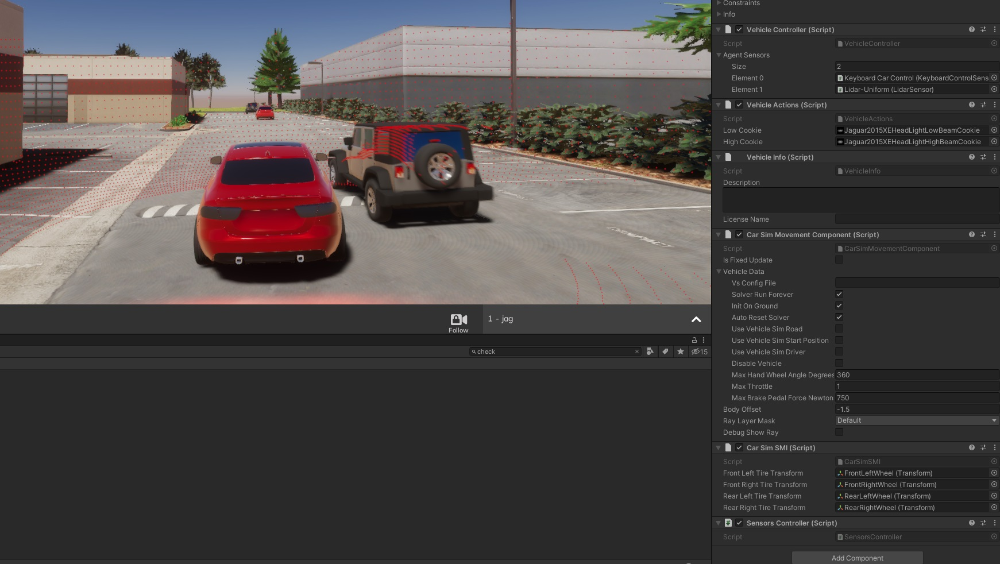 

1.Edit IVehicleDynamics.cs

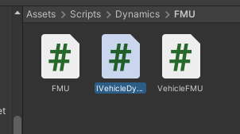 

Rigidbody RB { get; }

Since the above cannot be supported by CarSim, the velocity and angular velocity vectors of each axis and the velocity vector of each axis used by RigidBody are to be obtained.

This fixes what needs to be fixed to match the above. I won't bore you with the details of the fixes, but I'll tell you that I'm going to use the RigidBody variables in It's easy to use for the Interface stuff.

2.The latest CarSim script added to the LGSVL simulator

See the tutorial for details.

At that time, there is a script for LGSVL in Samples, so add it to Assets/Scripts/Dynamics/Examples

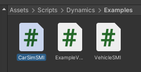 

3.Application to vehicles
The vehicle to be supported this time is the Jaguar 2015XE, which is close enough to be used.

https://github.com/lgsvl/Jaguar2015XE

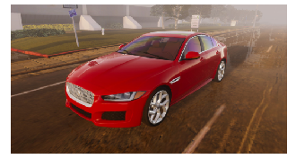 

Double click on the Jaguar 2015XE prefab to fix it.

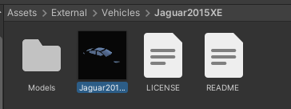 

Removing the VehicleSMI component

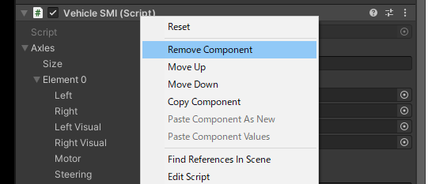 

CarSimSMI is added, and CarSimComponent is added as well.

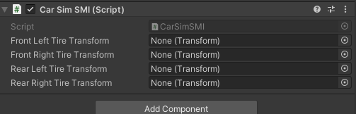 

Set the Transform of the tire to CarSimSMI.

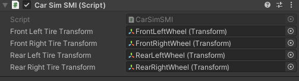 

Since the origin of the CarSim and LGSVL bodies are different, the CarSimComponent has a Enter a BodyOffset of -1.5

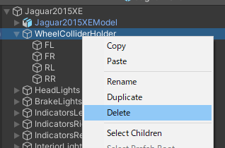 

Judgment by Ray is set only by default, but it is set according to the situation of use.

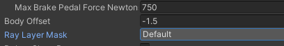 

Jaguar2015XE's RigitBody is unaffected, so check IsKinematic

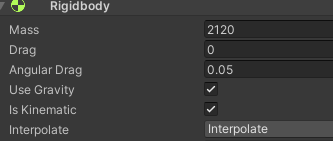 

Build and run AssetBundles.

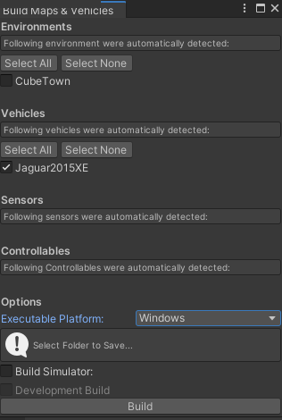 

*The problem is that I still don't know how to change the coefficient of friction for Physic Material in LGSVL and it slips.

