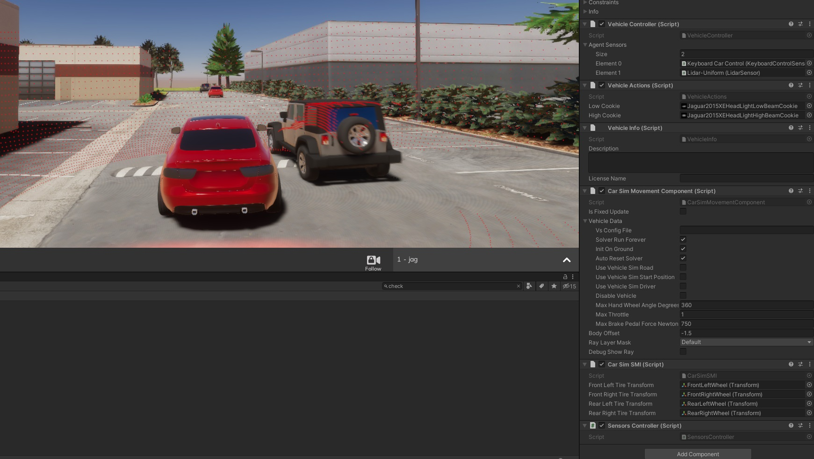
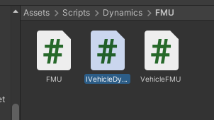
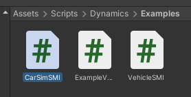
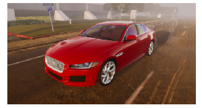
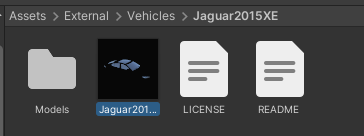
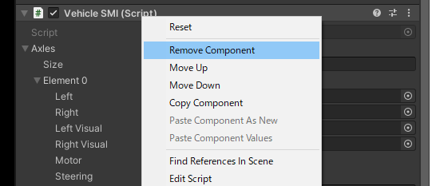
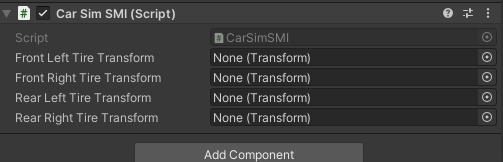

# VS UnityをLGSVLSimulatorへの適用

 

1.IVehicleDynamics.csを編集

 

Rigidbody RB { get; }

が存在するが上記はCarSimでは対応できないため、RigidBodyの使用している速度・各軸の速度ベクトル、角速度ベクトルを取得するようにする。

それにより上記に合わせて修正すべき点を修正。修正内容に関しては割愛します。RigidBodyの変数を使用しているものをInterfaceのものに使用するだけなので簡単です。

2.LGSVLシミュレータに最新のCarSimのスクリプトを追加

詳細はチュートリアルを参照

その際にSamplesにLGSVL用のスクリプトがあるのでそれをAssets/Scripts/Dynamics/Examplesに追加

 

3.車両への適用
今回対応させる車両はJaguar2015XEが近しいのでそれを使用する。

https://github.com/lgsvl/Jaguar2015XE

 

Jaguar2015XEのプレハブをダブルクリックし修正。

 

VehicleSMIコンポーネントを削除

 

CarSimSMIを追加その際にCarSimComponentも追加される。

 

CarSimSMIに対してタイヤのTransformを設定する。

 

CarSimとLGSVLのボディの原点が異なるので、CarSimComponentでBodyOffsetを-1.5を入力する

 

Rayによる判定はDefaultのみに設定しているが、使用状況に合わせて設定。

 

Jaguar2015XEのRigitBodyは影響は受けないのでIsKinematicをチェックする

 

AssetBundlesをビルドし、実行する。

 

*問題点としてはまだLGSVLのPhysic Materialの摩擦係数の変更がわからず、スリップしてしまう。

