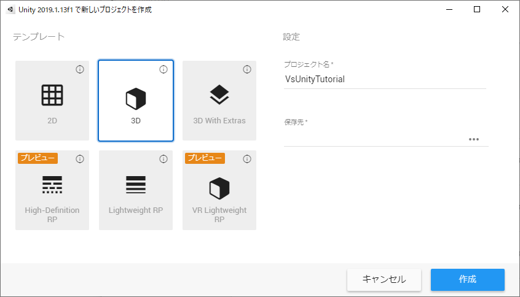
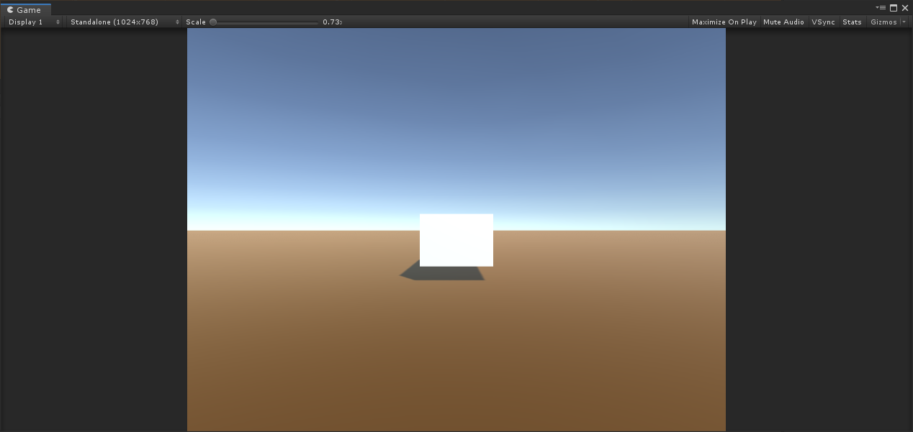
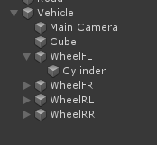

# VS Unity Tutrial

1.Clone or download the VsDotnet project

2.Choose a template 3D in Unity2019 (2019.1.13f1 in this case). The name of the project will be VsUnity Tutorial here.
 

3．Press the File menu->Build Settings->Player Settings.
Set Api Compatiblity Level of Player's Configuraion category to
Check the Allow 'unsafe' Code.

 
 
4．Copy the cloned Assets/StreamingAssets and Assets/Scripts folders of VsUnityTutorial to the newly created Assets of VsUnityTutorial.

 
 

Make sure there are no errors in the Console when you return to Unity

 
 
5．Create a ground
In Hierachy, right-click GameObject->3D Object->Plane

 
 
Set Position to 0,0,0 and Scale to 100,100,100 for the added ground. Here we have set the brown material for the ground, but you can set it as you see fit.

 
 

6．Add a GameObject as a base for the vehicle. As with the ground, right-click on Hierachy and select GameObject->Create Empty. Add "Vehicle" and "Raw" to the added GameObject. This position is also set to 0,0,0.

 
 
7．Right-click on the added Vehicle in Hierachy and select GameObject->Cube.

 

For the vehicle body of the car, we set the values to Position0,0.8,-1.33,Scale,1.4,1,4 here. To be precise, adjust the position and size to fit the coordinate system of CarSim settings.

 

Also, uncheck BoxColider and disable it. (Because CarSim does not support collisions)

 
 
8．Drag and drop Scripts/CarSimSample.cs to Vehicle.
 

9.Launch CarSim after the drop. Make sure that CarSim Solver for Windows is checked when you start it up.

 
 
 
10．It runs on the editor. Then the Vehicle's GameObject will start running at idle. Pressing the up, down, left and right keys on the Game screen after you start driving updates the accelerator, brake and steering. We will stop when we are sure.

 

11．With Vehicle selected, right click on it and press GameObject->Create Empty. Rename the added GameObject as WheelFL and right-click on it and select GameObject->3D Object->Cylindar.

  

Set Rotaion90,0,90, Scale0.65,0.1,0.65 for Cylindar.

  

It also disables Capsel Collidar.

  

Move WheelFL to the wheel position that has been set in CarSim.

   

12．Duplicate three WheelFLs and move them to their respective positions as WheelFR, WheelRL and WheelRR.

  
 
13．When you select a vehicle, there is a reference to the Transform of each tire in the CarSimSample component of Inspector, so drag each one and set it.

  

14．If you run it again, the position and angle of the tire will be updated to match the key input.

