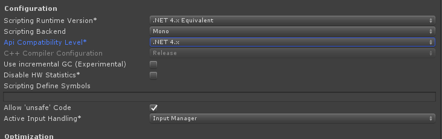
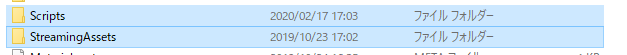
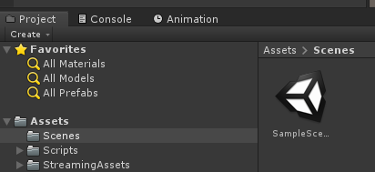
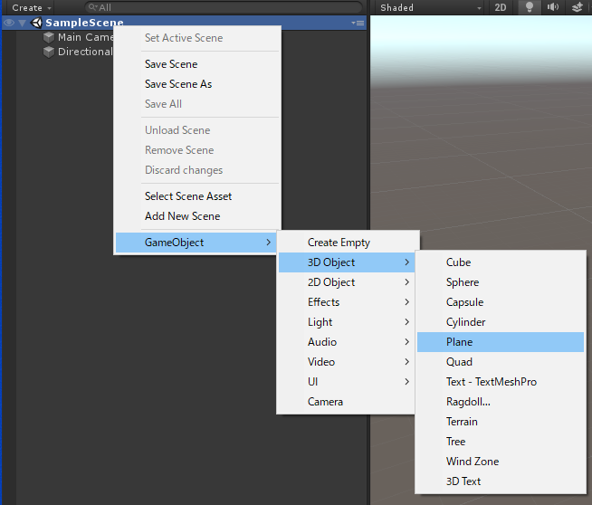
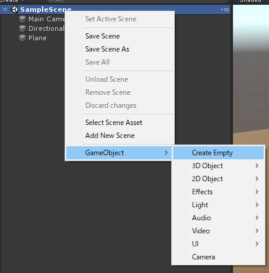
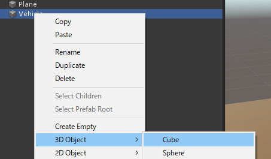
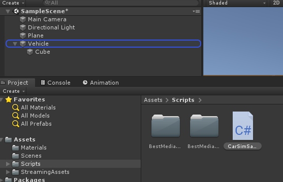
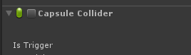
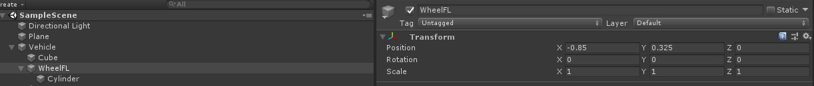

# VS Unityチュートリアル

1.VsDotnetプロジェクトをCloneかダウンロードしてください

2.Unity2019(ここでは2019.1.13f1)でテンプレート３Dを選びます。プロジェクト名はここではVsUnity Tutorialとします。
 

3．Fileメニュー->Build Settings->Player Settingsを押します。
Playerの ConfiguraionカテゴリのApi Compatiblity Levelを.NET4.xにします。
Allow ‘unsafe’ Codeにチェックをします。

 
 
4．CloneしたVsUnityTutorialのAssets/StreamingAssetsおよびAssets/Scriptsフォルダを新規作成したVsUnityTutorialのAssetsへコピーします。

 
 

Unityに戻った際にConsoleにエラーが出ないことを確認してください

 
 
5．まず地面を作成します
Hierachyで右クリックGameObject->3D Object->Planeを選択します

 
 
追加した地面に対して、Positionを0，0，0、Scaleを100,100,100にします。ここでは地面に茶色のマテリアルを設定していますが、適宜設定してください。

 
 

6．車両のベースとなるGameObjectを追加します。地面と同様にHierachyで右クリックしGameObject->Create Emptyを選択します。追加したGameObjectにVehicleと生を付けます。この位置も0,0,0にしておきます。

 
 
7．追加したVehicleをHierachyで右クリックし、GameObject->Cubeを選択します。

 

車の車両本体で、ここではPosition0,0.8,-1.33,Scale,1.4,1,4に設定します。正確にはCarSimの設定の座標系に合う用に位置・サイズの調整を行います。

 

またBoxColiderのチェックを外し無効にします。(CarSimは衝突などに対応していないため)

 
 
8．Scripts/CarSimSample.csをVehicleへドラッグ＆ドロップします
 

9.ドロップ後CarSimを立ち上げます。立ち上げの際にCarSim Solver for Windowsにチェックがついていることを確認します。

 
 
 
10．エディタ上で実行します。するとVehicleのGameObjectがアイドリングで走り出します。走り出した後Game画面で上下左右キーを押すとアクセル・ブレーキ・ステアリングが更新され走ります。確認できたら停止します。

 

11．ここに、車輪を追加していきます。Vehicleを選択した状態で右クリックしGameObject->Create Emptyを押します。追加されたGameObjectをWheelFLと名称変更し、それを右クリックしGameObject->3D Object->Cylindarを選択します.

  

Cylindarに対してRotaion90,0,90, Scale0.65,0.1,0.65を設定します。

  

またその際にCapsel Collidarを無効にします。
  

WheelFLをCarSimで設定されているホイール位置に移動します。

   

12．WheelFLを3つ複製しWheelFR,WheelRL,WheelRRとしてそれぞれの位置に移動させます

  
 
13．Vehicleを選択した際にInspectorのCarSimSampleコンポネントで各タイヤのTransformへの参照があるのでそれぞれをドラッグして設定します。

  

14．再度実行するとタイヤの位置・角度がキー入力に合わせて更新されます。

